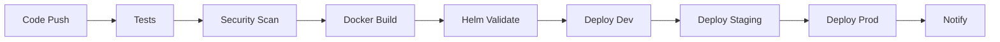

# Task Management API - Production Deployment Guide

## 📋 Table of Contents

- [Overview](#overview)
- [Prerequisites](#prerequisites)
- [Security Considerations](#security-considerations)
- [Docker Containerization](#docker-containerization)
- [Kubernetes Deployment with Helm](#kubernetes-deployment-with-helm)
- [CI/CD Pipeline](#cicd-pipeline)
- [Environment Configuration](#environment-configuration)
- [Monitoring and Observability](#monitoring-and-observability)
- [Troubleshooting](#troubleshooting)
- [Production Checklist](#production-checklist)

## 🎯 Overview

This document provides comprehensive instructions for deploying the Task Management API, a production-ready FastAPI application with advanced DevOps practices including containerization, Kubernetes orchestration, and automated CI/CD pipelines.

### Architecture Overview

```
┌─────────────────┐    ┌──────────────────┐    ┌─────────────────────┐
│   Developer     │───▶│   GitHub Actions │───▶│   Kubernetes        │
│   Workstation   │    │   CI/CD Pipeline │    │   Cluster           │
└─────────────────┘    └──────────────────┘    └─────────────────────┘
                              │                           │
                              ▼                           ▼
                       ┌──────────────┐           ┌──────────────┐
                       │  Container   │           │  Helm Chart  │
                       │  Registry    │           │  Deployment  │
                       │  (GHCR)      │           │              │
                       └──────────────┘           └──────────────┘
```

## 🔧 Prerequisites

### Required Software

| Tool | Version | Purpose |
|------|---------|---------|
| **Docker** | 20.10+ | Container runtime and image building |
| **Kubernetes** | 1.24+ | Container orchestration platform |
| **Helm** | 3.10+ | Kubernetes package manager |
| **kubectl** | 1.24+ | Kubernetes command-line tool |
| **Python** | 3.11+ | Application runtime (for local development) |
| **Git** | 2.30+ | Source code management |

### Infrastructure Requirements

#### Minimum System Requirements

- **CPU**: 2 vCPUs per node
- **Memory**: 4GB RAM per node
- **Storage**: 20GB available disk space
- **Network**: Reliable internet connection for image pulls

#### Production Cluster Specifications

- **Nodes**: Minimum 3 worker nodes for high availability
- **Pod Resources**: 
  - Requests: 100m CPU, 128Mi memory per pod
  - Limits: 500m CPU, 512Mi memory per pod
- **Storage**: Persistent volumes for logs and temporary data
- **Load Balancer**: Cloud provider load balancer or ingress controller

### Cloud Provider Setup

#### AWS EKS
```bash
# Install AWS CLI and eksctl
aws configure
eksctl create cluster --name task-api-cluster --region us-west-2 --nodes 3
```

#### Google GKE
```bash
# Install gcloud CLI
gcloud container clusters create task-api-cluster --num-nodes=3 --zone=us-central1-a
```

#### Azure AKS
```bash
# Install Azure CLI
az aks create --resource-group myResourceGroup --name task-api-cluster --node-count 3
```

## 🔒 Security Considerations

### Container Security

#### Implemented Security Measures

1. **Non-root User Execution**
   ```dockerfile
   # User ID 1000 with minimal privileges
   USER appuser:appgroup
   ```

2. **Minimal Base Image**
   ```dockerfile
   # Using slim Python image with specific version
   FROM python:3.11.9-slim-bookworm
   ```

3. **Read-only Root Filesystem**
   ```yaml
   securityContext:
     readOnlyRootFilesystem: true
   ```

4. **Dropped Capabilities**
   ```yaml
   capabilities:
     drop: ["ALL"]
   ```

5. **Security Context Constraints**
   ```yaml
   runAsNonRoot: true
   allowPrivilegeEscalation: false
   ```

#### Vulnerability Scanning

- **Trivy**: Automated vulnerability scanning in CI/CD
- **SBOM Generation**: Software Bill of Materials for compliance
- **Dependency Scanning**: Safety checks for Python packages

### Kubernetes Security

#### Network Policies
```yaml
# Restrict pod-to-pod communication
networkPolicy:
  enabled: true
  policyTypes: [Ingress, Egress]
```

#### Pod Security Standards
```yaml
# Enforce security policies
podSecurityContext:
  runAsNonRoot: true
  seccompProfile:
    type: RuntimeDefault
```

#### Secrets Management
```yaml
# Kubernetes secrets for sensitive data
secret:
  enabled: true
  data:
    DATABASE_URL: "encrypted-value"
    SECRET_KEY: "encrypted-value"
```

### TLS/SSL Configuration

#### Ingress TLS
```yaml
ingress:
  tls:
    - secretName: task-api-tls
      hosts:
        - task-api.yourcompany.com
```

#### Certificate Management
```bash
# Using cert-manager for automated certificate provisioning
kubectl apply -f https://github.com/cert-manager/cert-manager/releases/download/v1.13.0/cert-manager.yaml
```

## 🐳 Docker Containerization

### Building the Docker Image

#### Local Build
```bash
# Build with security optimizations
docker build -t task-management-api:latest .

# Multi-platform build
docker buildx build --platform linux/amd64,linux/arm64 -t task-management-api:latest .
```

#### Build Arguments
```bash
docker build \
  --build-arg VERSION=2.0.0 \
  --build-arg BUILDTIME=$(date -u +"%Y-%m-%dT%H:%M:%SZ") \
  --build-arg REVISION=$(git rev-parse HEAD) \
  -t task-management-api:2.0.0 .
```

### Security Scanning

#### Trivy Vulnerability Scan
```bash
# Scan Docker image for vulnerabilities
trivy image task-management-api:latest

# Generate SARIF report
trivy image --format sarif --output results.sarif task-management-api:latest
```

#### Best Practices Verification
```bash
# Use Docker Scout for security recommendations
docker scout cves task-management-api:latest
docker scout recommendations task-management-api:latest
```

### Running Locally

#### Basic Run
```bash
docker run -d \
  --name task-api \
  -p 8000:8000 \
  --health-cmd="curl -f http://localhost:8000/health || exit 1" \
  --health-interval=30s \
  task-management-api:latest
```

#### Production-like Run
```bash
docker run -d \
  --name task-api-prod \
  -p 8000:8000 \
  --env PORT=8000 \
  --env WORKERS=4 \
  --env TIMEOUT=60 \
  --memory=512m \
  --cpus=0.5 \
  --read-only \
  --tmpfs /tmp \
  --tmpfs /app/logs \
  --user 1000:1000 \
  task-management-api:latest
```

### Docker Compose for Development

```yaml
# docker-compose.yml
version: '3.8'
services:
  task-api:
    build: .
    ports:
      - "8000:8000"
    environment:
      - APP_ENV=development
      - LOG_LEVEL=debug
    volumes:
      - ./src:/app/src:ro
    healthcheck:
      test: ["CMD", "curl", "-f", "http://localhost:8000/health"]
      interval: 30s
      timeout: 10s
      retries: 3
```

## ⎈ Kubernetes Deployment with Helm

### Helm Chart Installation

#### Install Helm
```bash
# Install Helm (Linux/macOS)
curl https://raw.githubusercontent.com/helm/helm/main/scripts/get-helm-3 | bash

# Verify installation
helm version
```

#### Add Required Repositories
```bash
# Add ingress-nginx for ingress controller
helm repo add ingress-nginx https://kubernetes.github.io/ingress-nginx
helm repo add cert-manager https://charts.jetstack.io
helm repo update
```

### Deployment Commands

#### Development Environment
```bash
# Deploy to development namespace
helm upgrade --install task-api-dev ./helm/task-management-api \
  --namespace development \
  --create-namespace \
  --values ./helm/task-management-api/values-dev.yaml \
  --set image.tag=dev-latest \
  --wait \
  --timeout=300s
```

#### Staging Environment
```bash
# Deploy to staging namespace
helm upgrade --install task-api-staging ./helm/task-management-api \
  --namespace staging \
  --create-namespace \
  --values ./helm/task-management-api/values-staging.yaml \
  --set image.tag=staging-$(git rev-parse --short HEAD) \
  --wait \
  --timeout=600s
```

#### Production Environment
```bash
# Deploy to production namespace
helm upgrade --install task-api-prod ./helm/task-management-api \
  --namespace production \
  --create-namespace \
  --values ./helm/task-management-api/values-prod.yaml \
  --set image.tag=2.0.0 \
  --set secret.data.DATABASE_URL="$(echo -n 'your-db-url' | base64)" \
  --set secret.data.SECRET_KEY="$(echo -n 'your-secret-key' | base64)" \
  --wait \
  --timeout=900s
```

### Helm Operations

#### Chart Management
```bash
# Validate chart
helm lint ./helm/task-management-api

# Template chart (dry-run)
helm template task-api ./helm/task-management-api

# Package chart
helm package ./helm/task-management-api

# List deployments
helm list --all-namespaces

# Get deployment status
helm status task-api-prod --namespace production
```

#### Upgrades and Rollbacks
```bash
# Upgrade deployment
helm upgrade task-api-prod ./helm/task-management-api \
  --namespace production \
  --set image.tag=2.1.0

# Rollback deployment
helm rollback task-api-prod 1 --namespace production

# View deployment history
helm history task-api-prod --namespace production
```

#### Testing
```bash
# Run Helm tests
helm test task-api-prod --namespace production

# Debug deployment
helm get all task-api-prod --namespace production
```

### Environment-Specific Configurations

#### Development (values-dev.yaml)
- **Replicas**: 1
- **Resources**: Minimal (50m CPU, 64Mi memory)
- **Service Type**: NodePort
- **Ingress**: Enabled with HTTP
- **Monitoring**: Basic metrics

#### Production (values-prod.yaml)
- **Replicas**: 5 (with autoscaling 5-20)
- **Resources**: Production-grade (200m-1000m CPU, 256Mi-1Gi memory)
- **Service Type**: LoadBalancer
- **Ingress**: Enabled with HTTPS/TLS
- **Security**: Network policies, pod security contexts
- **Monitoring**: Full observability stack

## 🚀 CI/CD Pipeline

### Pipeline Architecture



### Pipeline Stages

#### 1. Testing Stage 🧪
```yaml
- Unit tests with pytest
- Code coverage analysis
- Linting (flake8, black, isort)
- Type checking (mypy)
```

#### 2. Security Stage 🔒
```yaml
- Trivy filesystem scan
- Dependency security scan (safety)
- Code security analysis (bandit)
- SARIF report generation
```

#### 3. Build Stage 🐳
```yaml
- Multi-platform Docker build (AMD64, ARM64)
- Image vulnerability scanning
- SBOM generation
- Container registry push (GHCR)
```

#### 4. Validation Stage ⎈
```yaml
- Helm chart linting
- Template validation
- Multi-environment testing
- Chart packaging
```

#### 5. Deployment Stages 🚀
```yaml
- Development: On develop branch push
- Staging: On main branch push
- Production: On release tag
```

### Required Secrets

#### GitHub Repository Secrets
```bash
# Kubernetes cluster access
KUBE_CONFIG_DEV         # Base64 encoded kubeconfig for development
KUBE_CONFIG_STAGING     # Base64 encoded kubeconfig for staging
KUBE_CONFIG_PRODUCTION  # Base64 encoded kubeconfig for production

# Application secrets
DATABASE_URL            # Database connection string
SECRET_KEY              # Application secret key
JWT_SECRET              # JWT signing secret

# Notifications
SLACK_WEBHOOK_URL       # Slack webhook for notifications

# Container registry (automatically provided by GitHub)
GITHUB_TOKEN            # GitHub token for GHCR access
```

#### Setting Up Secrets
```bash
# Encode kubeconfig for GitHub secrets
cat ~/.kube/config | base64 -w 0

# Add to GitHub repository secrets
# Go to: Repository → Settings → Secrets and variables → Actions
```

### Triggering Deployments

#### Automatic Triggers
```bash
# Development deployment
git push origin develop

# Staging deployment
git push origin main

# Production deployment
git tag v2.0.0
git push origin v2.0.0
```

#### Manual Triggers
```bash
# Trigger via GitHub CLI
gh workflow run ci-cd.yml --ref main

# Trigger via GitHub UI
# Go to: Repository → Actions → CI/CD Pipeline → Run workflow
```

### Pipeline Monitoring

#### Viewing Pipeline Status
```bash
# List workflow runs
gh run list --workflow=ci-cd.yml

# View specific run
gh run view <run-id>

# Watch live logs
gh run watch <run-id>
```

#### Debugging Failed Deployments
```bash
# Check deployment status
kubectl get deployments -n production
kubectl describe deployment task-management-api -n production

# View pod logs
kubectl logs -l app.kubernetes.io/name=task-management-api -n production --tail=100

# Check events
kubectl get events -n production --sort-by='.metadata.creationTimestamp'
```

## 🌍 Environment Configuration

### Environment Hierarchy

```
Development → Staging → Production
     ↓           ↓         ↓
   k3d/kind    Cloud     Cloud
   NodePort  LoadBalancer LoadBalancer
   HTTP only  HTTPS/TLS   HTTPS/TLS
```

### Configuration Management

#### ConfigMaps
```yaml
# Non-sensitive configuration
configMap:
  data:
    APP_ENV: "production"
    LOG_LEVEL: "info"
    CORS_ORIGINS: "https://yourcompany.com"
```

#### Secrets
```yaml
# Sensitive configuration
secret:
  data:
    DATABASE_URL: "base64-encoded-value"
    SECRET_KEY: "base64-encoded-value"
```

#### Environment Variables
```yaml
container:
  env:
    - name: PORT
      value: "8000"
    - name: WORKERS
      value: "4"
    - name: TIMEOUT
      value: "60"
```

### Resource Allocation

#### Development
```yaml
resources:
  requests:
    cpu: 50m
    memory: 64Mi
  limits:
    cpu: 200m
    memory: 256Mi
```

#### Production
```yaml
resources:
  requests:
    cpu: 200m
    memory: 256Mi
  limits:
    cpu: 1000m
    memory: 1Gi
```

## 📊 Monitoring and Observability

### Health Checks

#### Application Health Endpoint
```bash
# Health check endpoint
curl http://task-api.yourcompany.com/health

# Response format
{
  "status": "healthy",
  "timestamp": "2024-01-01T12:00:00Z",
  "version": "2.0.0",
  "uptime_seconds": 3600.0,
  "total_tasks": 150,
  "memory_usage_mb": 45.2
}
```

#### Kubernetes Probes
```yaml
# Liveness probe
livenessProbe:
  httpGet:
    path: /health
    port: 8000
  initialDelaySeconds: 30
  periodSeconds: 10

# Readiness probe
readinessProbe:
  httpGet:
    path: /health
    port: 8000
  initialDelaySeconds: 5
  periodSeconds: 5

# Startup probe
startupProbe:
  httpGet:
    path: /health
    port: 8000
  initialDelaySeconds: 10
  periodSeconds: 10
  failureThreshold: 30
```

### Metrics Collection

#### Prometheus Integration
```yaml
monitoring:
  enabled: true
  serviceMonitor:
    enabled: true
    interval: 30s
    path: /metrics
```

#### Grafana Dashboards
- Application metrics (requests, response times, errors)
- Infrastructure metrics (CPU, memory, disk, network)
- Business metrics (tasks created, completion rates)

### Logging

#### Structured Logging
```python
# Application logging configuration
logging.basicConfig(
    level=logging.INFO,
    format='{"timestamp":"%(asctime)s","level":"%(levelname)s","message":"%(message)s"}',
    handlers=[logging.StreamHandler()]
)
```

#### Log Aggregation
```bash
# View application logs
kubectl logs -l app.kubernetes.io/name=task-management-api -n production --tail=100 -f

# Export logs to external system
# Configure Fluentd/Fluent Bit for log forwarding
```

### Alerting

#### Alert Rules
```yaml
# Example Prometheus alert rules
groups:
  - name: task-management-api
    rules:
      - alert: HighErrorRate
        expr: rate(http_requests_total{status=~"5.."}[5m]) > 0.1
        for: 5m
        annotations:
          summary: High error rate detected
      
      - alert: HighMemoryUsage
        expr: container_memory_usage_bytes / container_spec_memory_limit_bytes > 0.8
        for: 5m
        annotations:
          summary: High memory usage detected
```

## 🐛 Troubleshooting

### Common Issues and Solutions

#### 1. Pod Startup Issues

**Problem**: Pods stuck in `Pending` or `CrashLoopBackOff` state

```bash
# Diagnosis
kubectl describe pod <pod-name> -n <namespace>
kubectl logs <pod-name> -n <namespace> --previous

# Common solutions
# - Check resource quotas
# - Verify image pull secrets
# - Check node capacity
# - Review security contexts
```

#### 2. Service Connectivity Issues

**Problem**: Service not accessible from outside cluster

```bash
# Diagnosis
kubectl get svc -n <namespace>
kubectl describe svc <service-name> -n <namespace>
kubectl get endpoints <service-name> -n <namespace>

# Common solutions
# - Verify service selector matches pod labels
# - Check ingress configuration
# - Validate network policies
# - Confirm load balancer provisioning
```

#### 3. Image Pull Issues

**Problem**: `ImagePullBackOff` or `ErrImagePull` errors

```bash
# Diagnosis
kubectl describe pod <pod-name> -n <namespace>

# Solutions
# - Verify image name and tag
# - Check registry authentication
# - Confirm image exists in registry
# - Review imagePullSecrets configuration
```

#### 4. Resource Constraints

**Problem**: Pods being killed due to resource limits

```bash
# Diagnosis
kubectl top pods -n <namespace>
kubectl describe node <node-name>

# Solutions
# - Increase resource limits
# - Optimize application resource usage
# - Scale horizontally
# - Add more nodes to cluster
```

#### 5. Configuration Issues

**Problem**: Application failing due to configuration errors

```bash
# Diagnosis
kubectl get configmap -n <namespace>
kubectl get secret -n <namespace>
kubectl describe configmap <configmap-name> -n <namespace>

# Solutions
# - Verify ConfigMap and Secret values
# - Check environment variable injection
# - Validate configuration format
# - Review application logs for config errors
```

### Debugging Commands

#### Cluster Information
```bash
# Cluster status
kubectl cluster-info
kubectl get nodes -o wide
kubectl top nodes

# Resource usage
kubectl top pods --all-namespaces
kubectl describe node <node-name>
```

#### Application Debugging
```bash
# Pod information
kubectl get pods -n <namespace> -o wide
kubectl describe pod <pod-name> -n <namespace>
kubectl logs <pod-name> -n <namespace> --tail=100 -f

# Service debugging
kubectl get svc -n <namespace>
kubectl get endpoints -n <namespace>
kubectl port-forward svc/<service-name> 8080:80 -n <namespace>
```

#### Helm Debugging
```bash
# Helm status
helm list --all-namespaces
helm status <release-name> -n <namespace>
helm get values <release-name> -n <namespace>

# Template debugging
helm template <release-name> ./helm/task-management-api --debug
helm upgrade --dry-run <release-name> ./helm/task-management-api -n <namespace>
```

### Performance Optimization

#### Application Tuning
```yaml
# Uvicorn worker configuration
container:
  env:
    - name: WORKERS
      value: "4"  # Adjust based on CPU cores
    - name: WORKER_CLASS
      value: "uvicorn.workers.UvicornWorker"
    - name: MAX_REQUESTS
      value: "2000"
    - name: MAX_REQUESTS_JITTER
      value: "200"
```

#### Resource Optimization
```yaml
# Right-size resource requests and limits
resources:
  requests:
    cpu: 100m      # Start conservative
    memory: 128Mi  # Monitor actual usage
  limits:
    cpu: 500m      # Allow burst capacity
    memory: 512Mi  # Prevent OOM kills
```

#### Autoscaling Configuration
```yaml
autoscaling:
  enabled: true
  minReplicas: 3
  maxReplicas: 10
  targetCPUUtilizationPercentage: 70
  targetMemoryUtilizationPercentage: 80
```

## ✅ Production Checklist

### Pre-Deployment Checklist

#### Security
- [ ] Container runs as non-root user
- [ ] Security contexts configured
- [ ] Network policies implemented
- [ ] Secrets properly managed
- [ ] TLS/SSL certificates configured
- [ ] Vulnerability scanning completed
- [ ] SBOM generated and reviewed

#### Configuration
- [ ] Environment-specific values files created
- [ ] Resource limits and requests defined
- [ ] Health checks configured
- [ ] ConfigMaps and Secrets created
- [ ] Ingress rules configured
- [ ] DNS records updated

#### Infrastructure
- [ ] Kubernetes cluster provisioned
- [ ] Node pools configured
- [ ] Storage classes available
- [ ] Load balancers configured
- [ ] Monitoring stack deployed
- [ ] Backup solutions implemented

#### CI/CD
- [ ] GitHub Actions workflows configured
- [ ] Repository secrets added
- [ ] Pipeline tested with sample deployment
- [ ] Rollback procedures verified
- [ ] Notification channels configured

### Post-Deployment Verification

#### Functional Testing
```bash
# Health check
curl -f https://task-api.yourcompany.com/health

# API documentation
curl -f https://task-api.yourcompany.com/docs

# Create test task
curl -X POST https://task-api.yourcompany.com/tasks \
  -H "Content-Type: application/json" \
  -d '{"title":"Production Test","category":"testing","priority":"high"}'

# Retrieve tasks
curl https://task-api.yourcompany.com/tasks
```

#### Performance Testing
```bash
# Load testing with Apache Bench
ab -n 1000 -c 10 https://task-api.yourcompany.com/health

# Stress testing with wrk
wrk -t12 -c400 -d30s https://task-api.yourcompany.com/health
```

#### Monitoring Verification
- [ ] Metrics being collected
- [ ] Logs being aggregated
- [ ] Alerts configured and tested
- [ ] Dashboards displaying data
- [ ] Health checks passing

#### Security Verification
- [ ] TLS certificate valid
- [ ] Security headers present
- [ ] Vulnerability scans clean
- [ ] Access controls working
- [ ] Audit logging enabled

### Maintenance Procedures

#### Regular Tasks
- **Daily**: Monitor application health and performance
- **Weekly**: Review security alerts and update dependencies
- **Monthly**: Analyze resource usage and optimize
- **Quarterly**: Update base images and review security policies

#### Backup Procedures
```bash
# Backup Helm values
helm get values task-api-prod -n production > backup-values.yaml

# Backup Kubernetes resources
kubectl get all -n production -o yaml > backup-resources.yaml

# Backup persistent data (if applicable)
kubectl exec -n production <pod-name> -- tar -czf - /app/data > backup-data.tar.gz
```

#### Disaster Recovery
```bash
# Restore from backup
helm upgrade task-api-prod ./helm/task-management-api \
  -n production \
  -f backup-values.yaml

# Verify restoration
kubectl get pods -n production
curl -f https://task-api.yourcompany.com/health
```

---

## 📞 Support and Contact

For technical support and questions:

- **Documentation**: This deployment guide
- **Issues**: GitHub Issues tracker
- **DevOps Team**: devops@yourcompany.com
- **On-call**: Slack #devops-alerts

---

**Production Deployment Status**: ✅ Ready for Enterprise Deployment

This deployment guide provides a complete, production-ready setup for the Task Management API with enterprise-grade security, monitoring, and operational procedures.